# 🚀 Code2Career

A full-stack Placement Preparation Platform built using **Spring Boot**, **React**, **MySQL**, **JWT Authentication**, **Railway**, and **Vercel**.

Code2Career helps students organize their placement preparation by providing a centralized platform to manage job opportunities, track applications, solve coding problems, store resumes, monitor progress through an interactive dashboard, and prepare for interviews using an AI-powered interview module.

---

## 📑 Table of Contents

- Overview
- Live Demo
- Tech Stack
- Features
- Screenshots
- Project Structure
- Authentication & Security
- Installation
- API Endpoints
- Future Improvements
- Author

---

# 📌 Overview

Code2Career is a full-stack web application designed to simplify placement preparation.

Students can:

- 💼 Track Job Opportunities
- 📝 Manage Job Applications
- 💻 Track Coding Problems
- 📄 Upload & Download Resumes
- 📊 View Dashboard Analytics
- 🤖 Practice AI Interviews

---

# 🚀 Live Demo

## Frontend (Vercel)

👉 https://code2-career-gamma.vercel.app

## Backend API (Railway)

👉 https://code2career-production.up.railway.app

---

# 🛠 Tech Stack

## Frontend

- React
- Vite
- Axios
- React Router
- CSS

## Backend

- Java 21
- Spring Boot
- Spring Security
- JWT Authentication
- Spring Data JPA
- Hibernate

## Database

- MySQL

## Deployment

- Vercel (Frontend)
- Railway (Backend)

---

# ✨ Features

## 🔐 Authentication

- User Registration
- User Login
- JWT Authentication
- Protected APIs
- BCrypt Password Encryption

---

## 📊 Dashboard

- Dashboard Statistics
- Total Jobs
- Applications Count
- Problems Solved
- Revision Count
- Difficulty Analytics

---

## 💼 Job Tracker

- Add Jobs
- Update Jobs
- Delete Jobs
- Track Job Opportunities

---

## 📝 Application Tracker

- Add Applications
- Update Status
- Delete Applications
- Add Notes
- Track Interview Progress

---

## 💻 Coding Problems

- Add Problems
- Edit Problems
- Delete Problems
- Track Difficulty
- Revision Tracking

---

## 📄 Resume Module

- Upload Resume
- Download Resume
- Delete Resume

---

## 🤖 AI Interview

- AI Interview Preparation
- Interview Practice Module

---

# 📸 Screenshots

## Login Page

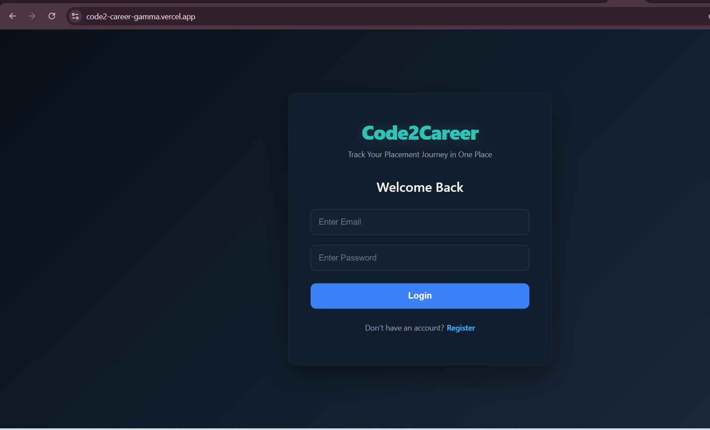

---

## Register Page

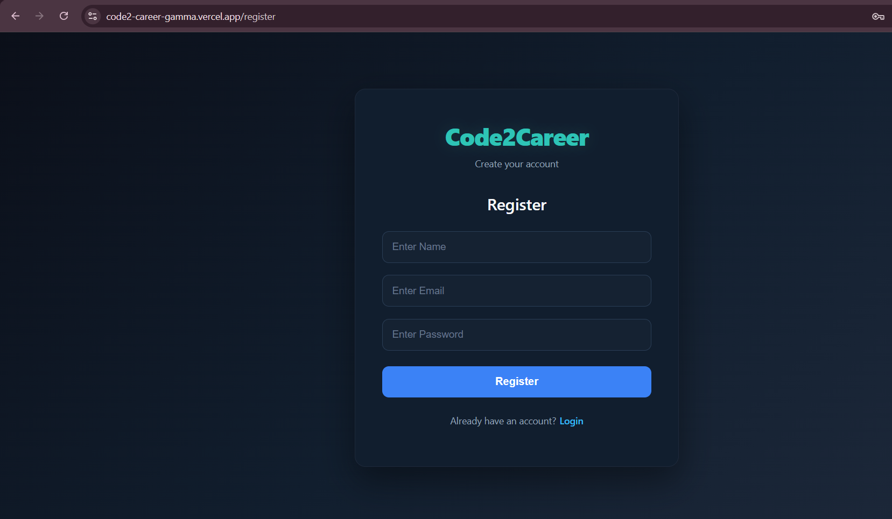

---

## Dashboard

### Dashboard Overview

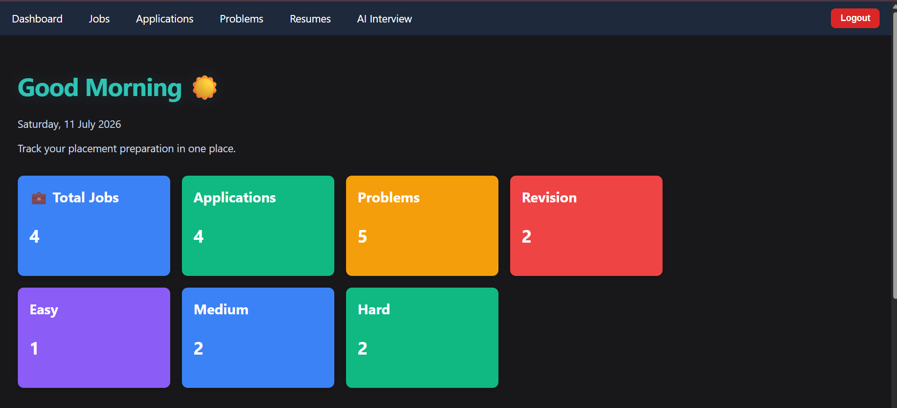

### Dashboard Analytics

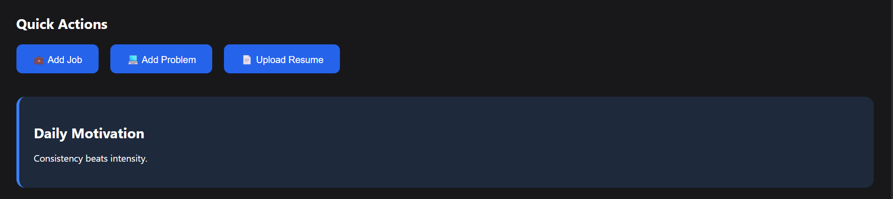

---

## Jobs Page

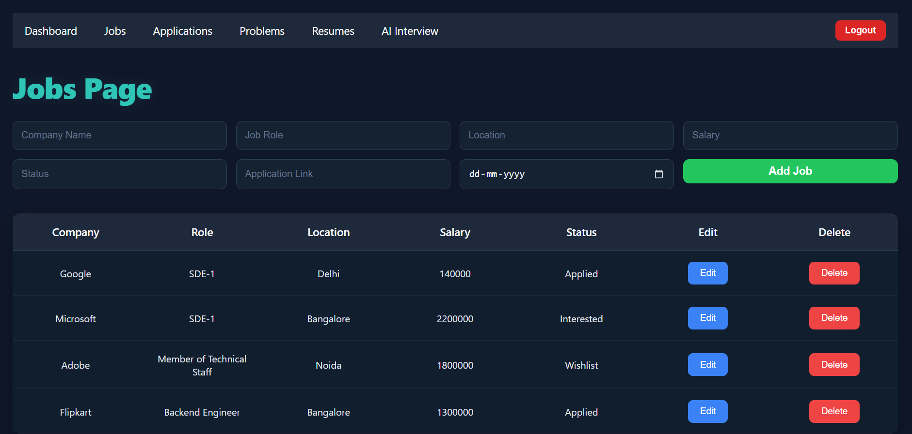

---

## Applications Page

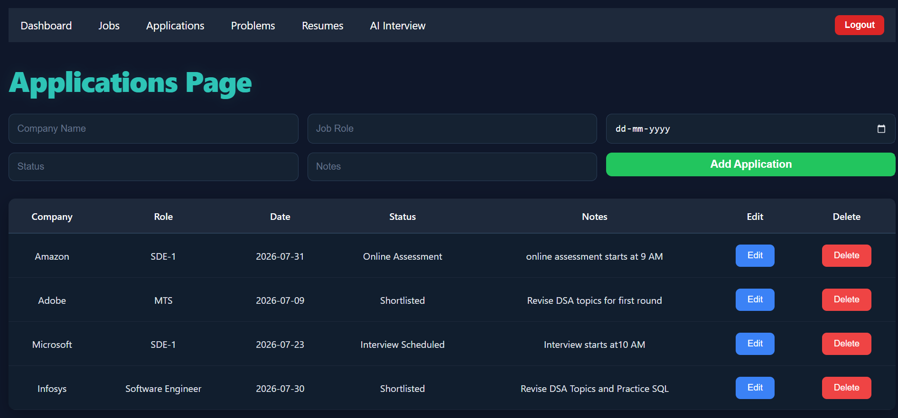

---

## Problems Page

### Problem List

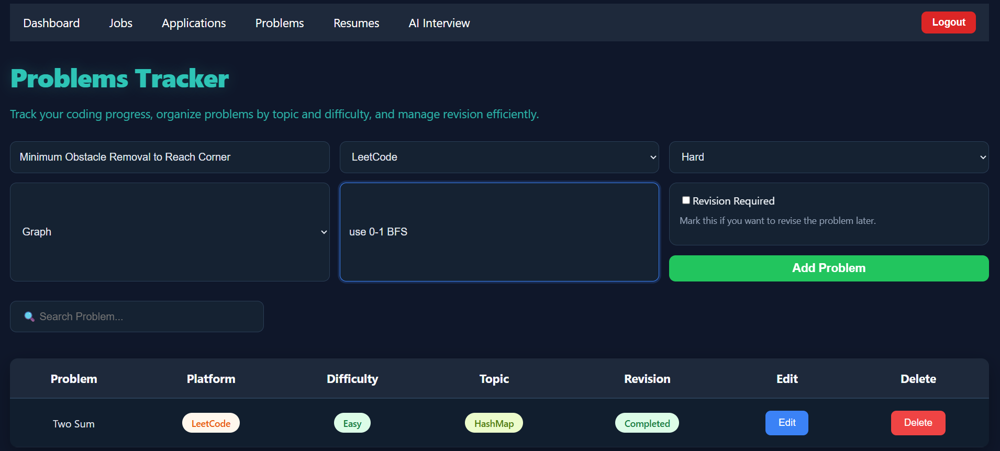

### Problem Details

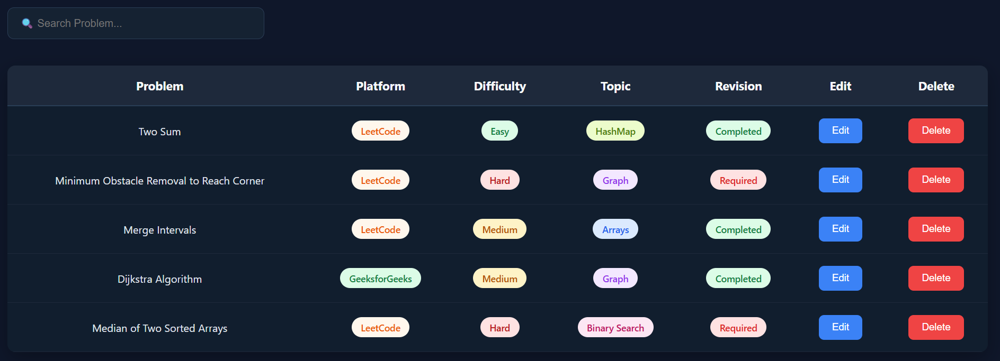

---

## Resume Module

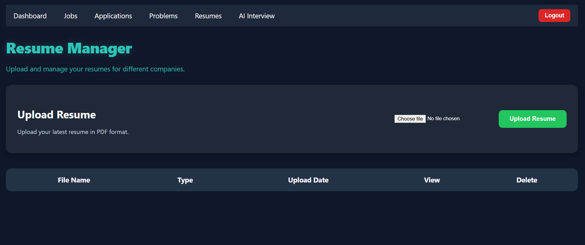

---

## AI Interview

### AI Interview Home

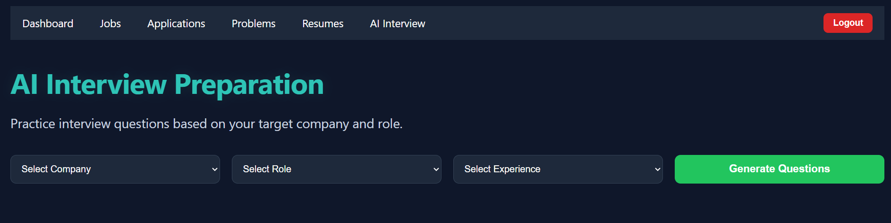

### Interview Session

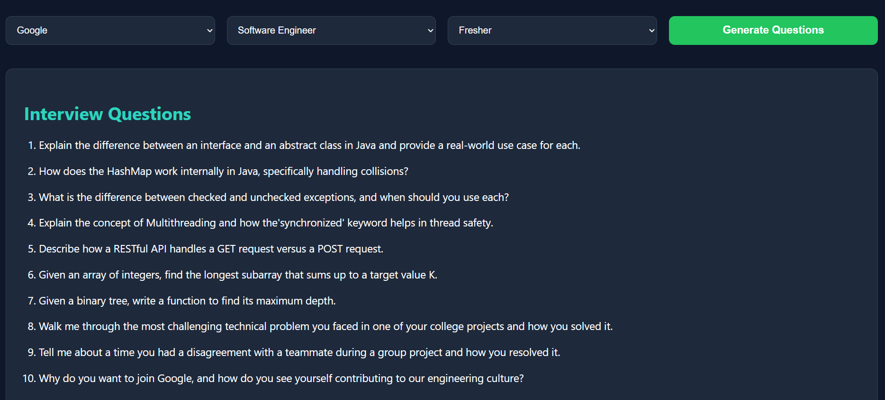

---

# 📂 Project Structure

```text
Code2Career
│
├── backend
│   ├── Controller
│   ├── Service
│   ├── Repository
│   ├── Entity
│   ├── DTO
│   ├── Security
│   └── Config
│
├── frontend
│   ├── Components
│   ├── Pages
│   ├── Services
│   ├── CSS
│   └── Assets
│
└── README.md
```

---

# 🔐 Authentication & Security

- JWT Authentication
- Spring Security
- BCrypt Password Encryption
- Protected REST APIs
- CORS Configuration

---

# ⚙️ Installation

## Clone Repository

```bash
git clone https://github.com/Manish-Khyalia/Code2Career.git
```

---

## Backend Setup

```bash
cd backend

mvn clean install

mvn spring-boot:run
```

---

## Frontend Setup

```bash
cd frontend

npm install

npm run dev
```

---

# 🔑 Environment Variables

Backend

Configure the following values in your application properties:

- Database URL
- Database Username
- Database Password
- JWT Secret Key

Frontend

Configure the backend API URL before deployment.

---

📡 API Endpoints

Method	   Endpoint	           Description

POST	    /auth/register	     Register User

POST	    /auth/login	         Login

GET	      /jobs	               Get Jobs

POST	    /jobs	               Add Job

PUT	      /jobs/{id}	         Update Job

DELETE	  /jobs/{id}	         Delete Job

GET	      /applications	       Get Applications

GET	      /problems	           Get Problems

POST	    /resume/upload	     Upload Resume

---

# 📈 Future Improvements

- Email Verification
- Forgot Password
- Company-wise Analytics
- Calendar for Deadlines
- Interview Scheduling
- AI Resume Review
- Notifications
- Dark/Light Theme
- Admin Panel
- Company Dashboard

---

# 👨‍💻 Author

**Manish Khyalia**

B.Tech Computer Science Engineering

DIT University

GitHub

https://github.com/Manish-Khyalia

LinkedIn

https://www.linkedin.com/in/manish-khyalia-874b54358

---

# 📄 License

This project is developed for educational and learning purposes.
